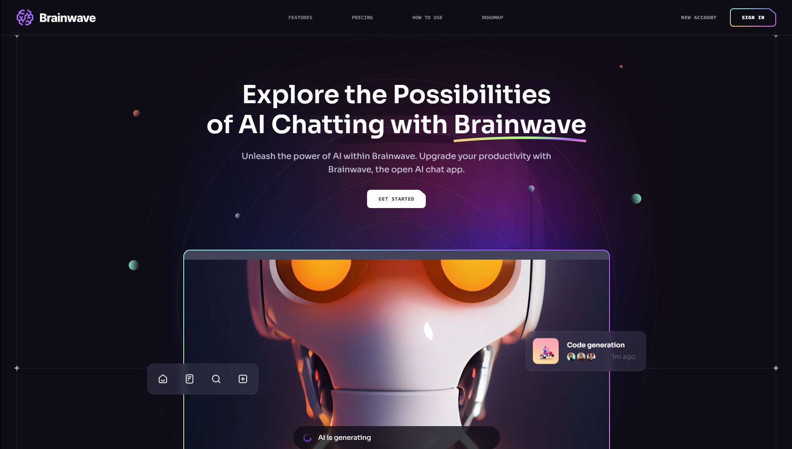

# 🌟 Brainwave Website



**Brainwave** is a visually captivating and responsive website designed with modern UI/UX principles. Built using **React**, **Vite**, and **Tailwind CSS**, this project showcases a stunning user interface with smooth parallax effects and a fully responsive design.

---

## 📋 Table of Contents

- [🔍 Introduction](#introduction)
- [🔧 Tech Stack](#tech-stack)
- [✨ Features](#features)
- [🚀 Getting Started](#getting-started)

---

## 🔍 Introduction

**Brainwave** is crafted to deliver an exceptional user experience through its modern design and responsive features. The website features engaging parallax effects and a clean, sleek interface. Whether you're looking to explore contemporary design or build upon this project, **Brainwave** sets a high standard in UI/UX.

---

## 🔧 Tech Stack

- **React**: A JavaScript library for building dynamic user interfaces.
- **Vite**: A fast build tool and development server.
- **Tailwind CSS**: A utility-first CSS framework for creating custom designs.

---

## ✨ Features

- **Parallax Effects**: Interactive and engaging animations triggered by user actions.
- **Responsive Design**: Seamlessly adapts to different screen sizes and devices.
- **Modern UI**: Sleek design with contemporary elements and clean aesthetics.
- **Smooth Animations**: Fluid transitions and effects for a polished user experience.

---

## 🚀 Getting Started

Follow these steps to set up the **Brainwave** project on your local machine:

### Prerequisites

Ensure you have the following installed:

- [Git](https://git-scm.com/)
- [Node.js](https://nodejs.org/)
- [npm](https://www.npmjs.com/)

### Clone the Repository

```bash
git clone https://github.com/YourUsername/brainwave.git
cd brainwave
